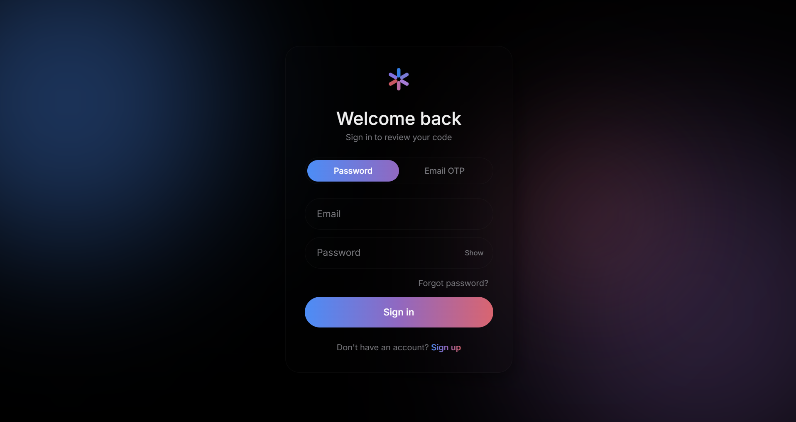
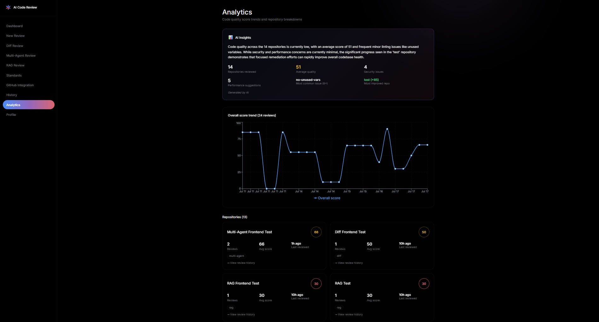
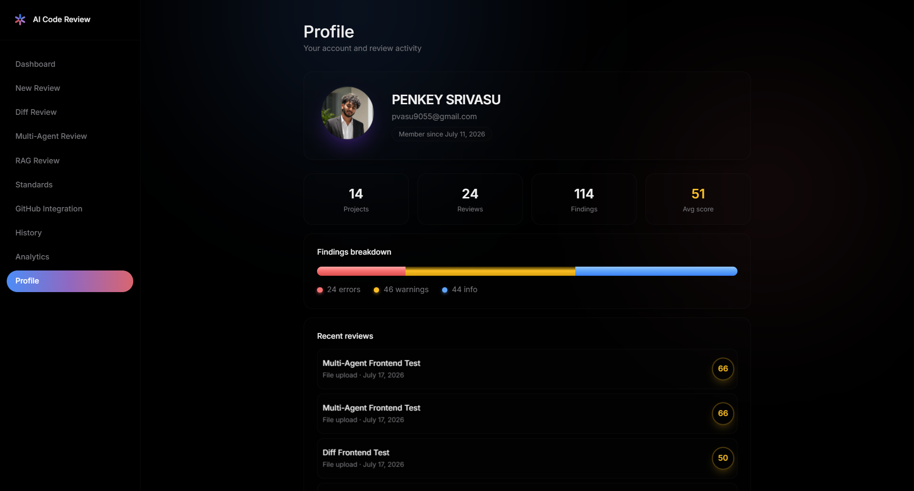
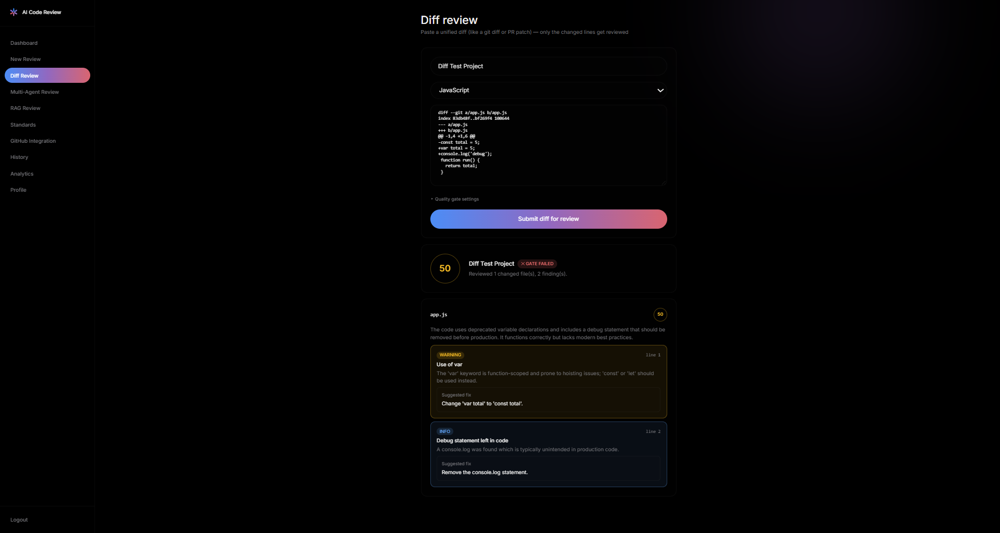
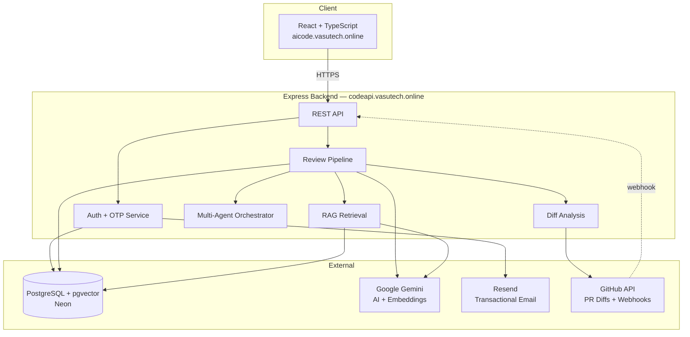

<div align="center">

# ⚡ AI Code Review Assistant

### An AI-powered code review platform that thinks like a senior engineering team — not just a linter.

[](https://aicode.vasutech.online)
[](https://codeapi.vasutech.online)
[]()

[](https://nodejs.org)
[](https://react.dev)
[](https://www.typescriptlang.org)
[](https://neon.tech)
[](https://ai.google.dev)
[](https://aws.amazon.com/elasticbeanstalk/)
[](https://vercel.com)

**[🚀 Live App](https://aicode.vasutech.online)** · **[📡 API](https://codeapi.vasutech.online)** · **[🐛 Report Bug](../../issues)**

</div>

---

## 📸 Preview

<div align="center">

| Login & Auth | AI Insights Dashboard |
|:---:|:---:|
| *Password + Email OTP, glassmorphism UI* | *AI-generated cross-repo insights* |
|  |  |

| Profile | Diff Review |
|:---:|:---:|
| *3D tilt-interactive stats* | *PR-style focused review* |
|  |  |

</div>

> 💡 Create a `docs/screenshots/` folder in your repo and drop in PNGs with these filenames — they'll render automatically above.

---

## ✨ Why This Isn't Just Another "AI Wrapper"

Most AI code review tools are a single prompt wrapped in a UI. This one isn't:

- 🔍 **Reviews diffs, not just files** — like a real PR reviewer, focusing only on what changed
- 🤖 **Four specialized AI agents**, not one generalist — bugs, security, performance, and quality reviewed independently, then synthesized
- 📚 **True RAG pipeline** — your team's actual coding standards get embedded into a vector DB and retrieved per-review, so findings cite *your* rules, not generic advice
- 🔗 **Closes the loop with GitHub** — PR webhooks trigger automatic reviews, with results posted straight back as PR comments
- 🧠 **Meta-analysis layer** — a second AI pass analyzes trends *across* all your past reviews and writes a plain-English engineering summary
- 🔐 **Production-grade auth** — password + email OTP, rate limiting, forgot-password, verified custom-domain transactional email

---

## 🧩 Feature Matrix

| Feature | Description |
|---|---|
| 📝 **Paste / Upload Review** | Static analysis + AI review + complexity metrics + auto-docs, in one pass |
| 🔀 **Diff-Aware Review** | Submit a unified diff — only changed lines get reviewed, PR-style |
| 🤖 **Multi-Agent Review** | 4 specialist agents (bugs / security / performance / quality) + aggregator |
| 📚 **RAG Standards Review** | Upload your style guide → embedded → retrieved per-review → compliance-checked |
| 🐙 **GitHub PR Integration** | Webhook-triggered reviews, posted automatically as PR comments |
| 📊 **Analytics & AI Insights** | Score trends, per-repo breakdowns, and an AI-written summary of patterns |
| 🔎 **Semantic Search** | Vector search across your entire review history — search by meaning, not keywords |
| ⚡ **Live Streaming Review** | Server-Sent Events stream the AI's review token-by-token |
| 💬 **In-Review Chat** | Ask follow-up questions about any review, with full context |
| 🔐 **Dual-Mode Auth** | Password or Email OTP, for both signup and login |
| 🔁 **Forgot Password** | OTP-based reset flow, no dead "reset link" emails |
| 🛡️ **Rate Limiting** | OTP endpoints capped to prevent abuse |
| ✉️ **Branded Transactional Email** | Sent via Resend from a verified custom domain |

---

## 🏗️ Architecture



**Infra:** AWS Elastic Beanstalk (backend) · Vercel (frontend) · Neon Postgres · Cloudflare (DNS/SSL) · Resend (email)

---

## 🔬 Deep Dive: The Four Review Modes

<table>
<tr>
<td width="50%" valign="top">

### 1️⃣ Diff-Aware Review
Parses a unified `git diff`, extracts only added/changed lines per file, and reviews *just the delta* — the same way a human reviews a pull request instead of re-reading the whole codebase every time.

```
git diff
    ↓
parse-diff → per-file changed lines
    ↓
AI reviews only the delta
    ↓
Aggregated multi-file report
```

</td>
<td width="50%" valign="top">

### 2️⃣ Multi-Agent Review
Four independent AI passes, each with a narrow specialty, run in sequence and get combined into one report — mirroring how real teams split review responsibilities.

```
Code
 ├─▶ 🐛 Bug Detection Agent
 ├─▶ 🔒 Security Agent
 ├─▶ ⚡ Performance Agent
 └─▶ 📐 Code Quality Agent
        ↓
   Aggregated Report
```

</td>
</tr>
<tr>
<td width="50%" valign="top">

### 3️⃣ RAG Standards Review
Your coding standards document is chunked and embedded into `pgvector`. At review time, the submitted code is embedded too, and a similarity search retrieves the most relevant standard passages — which get injected directly into the AI's prompt.

```
Style Guide PDF/TXT
    ↓
Chunked + Embedded
    ↓
pgvector similarity search
    ↓
AI reviews code against
YOUR retrieved standards
```

</td>
<td width="50%" valign="top">

### 4️⃣ GitHub PR Integration
A registered webhook fires on PR events, the diff is pulled via the GitHub API, run through the diff-aware pipeline, and the findings are posted back as real PR comments — fully automated.

```
GitHub Pull Request
    ↓
Webhook (HMAC verified)
    ↓
Fetch PR diff via API
    ↓
Diff-aware AI review
    ↓
Comments posted to PR
```

</td>
</tr>
</table>

---

## 🛠️ Tech Stack

<table>
<tr>
<td valign="top" width="33%">

**Backend**
- Node.js 22 + Express 5
- Prisma ORM
- PostgreSQL + pgvector (Neon)
- Google Gemini API
- Resend (email)
- JWT + bcryptjs
- Multer, express-rate-limit

</td>
<td valign="top" width="33%">

**Frontend**
- React + TypeScript
- Vite
- Tailwind CSS
- Recharts
- React Router
- Axios

</td>
<td valign="top" width="33%">

**Infrastructure**
- AWS Elastic Beanstalk
- Vercel
- Neon (serverless Postgres)
- Cloudflare (DNS/SSL)
- Resend
- Custom domains + HTTPS everywhere

</td>
</tr>
</table>

---

## 🔑 Authentication System

Built as a genuinely complete auth system, not a starter-kit stub:

- ✅ Password auth (bcrypt-hashed)
- ✅ Email OTP auth — alternative signup/login flow, 6-digit codes, 5-min expiry, single-use
- ✅ Forgot password via OTP (no dead reset-link emails)
- ✅ Rate limiting on all OTP endpoints (5 req / 15 min / IP)
- ✅ `emailVerified` tracking, auto-set on first successful OTP
- ✅ "Remember me" → 30-day tokens
- ✅ Branded HTML emails sent from a verified custom domain via Resend

---

## 📡 API Reference

<details>
<summary><b>Auth endpoints</b></summary>

| Method | Route | Description |
|---|---|---|
| `POST` | `/api/auth/signup` | Password signup |
| `POST` | `/api/auth/login` | Password login |
| `POST` | `/api/auth/otp/email/signup/request` | Send signup OTP |
| `POST` | `/api/auth/otp/email/signup/verify` | Verify OTP + create account |
| `POST` | `/api/auth/otp/email/login/request` | Send login OTP |
| `POST` | `/api/auth/otp/email/login/verify` | Verify OTP + login |
| `POST` | `/api/auth/otp/password/reset/request` | Request password reset code |
| `POST` | `/api/auth/otp/password/reset/verify` | Verify code + set new password |
| `POST` | `/api/auth/avatar` | Upload profile avatar |

</details>

<details>
<summary><b>Review endpoints</b></summary>

| Method | Route | Description |
|---|---|---|
| `POST` | `/api/reviews/submit-code` | Full review of pasted code |
| `POST` | `/api/reviews/submit-file` | Full review of uploaded file |
| `POST` | `/api/reviews/diff` | Diff-aware PR-style review |
| `POST` | `/api/reviews/multi-agent` | Multi-agent review |
| `POST` | `/api/reviews/rag` | RAG standards-based review |
| `GET` | `/api/reviews` | Review history (search/filter/sort) |
| `GET` | `/api/reviews/:reviewId` | Single review detail |
| `DELETE` | `/api/reviews/:reviewId` | Delete a review |
| `POST` | `/api/reviews/:reviewId/chat` | Chat about a review |
| `GET` | `/api/reviews/stream-review` | SSE-streamed live review |
| `GET` | `/api/reviews/search` | Semantic search |
| `GET` | `/api/reviews/analytics/trend` | Score trend over time |
| `GET` | `/api/reviews/projects` | Per-project analytics |
| `GET` | `/api/reviews/insights` | AI-generated cross-repo insights |

</details>

<details>
<summary><b>Standards & GitHub endpoints</b></summary>

| Method | Route | Description |
|---|---|---|
| `POST` | `/api/standards/upload` | Upload + embed coding standards |
| `POST` | `/api/github/webhook` | PR webhook receiver (HMAC-verified) |

</details>

---

## 📁 Project Structure

<details>
<summary>Click to expand</summary>

```
ai-code-review-assistant/
├── backend/
│   ├── prisma/
│   │   ├── schema.prisma
│   │   └── migrations/
│   ├── src/
│   │   ├── controllers/
│   │   │   ├── authController.js
│   │   │   ├── otpAuthController.js
│   │   │   ├── reviewController.js
│   │   │   ├── standardsController.js
│   │   │   └── githubController.js
│   │   ├── middleware/
│   │   │   ├── authMiddleware.js
│   │   │   ├── otpRateLimiter.js
│   │   │   ├── uploadMiddleware.js
│   │   │   └── errorMiddleware.js
│   │   ├── routes/
│   │   ├── services/
│   │   │   ├── aiReviewService.js
│   │   │   ├── aiReviewStreamService.js
│   │   │   ├── staticAnalysisService.js
│   │   │   ├── complexityAnalysisService.js
│   │   │   ├── docGenerationService.js
│   │   │   ├── chatService.js
│   │   │   ├── embeddingService.js
│   │   │   ├── diffAnalysisService.js
│   │   │   ├── multiAgentReviewService.js
│   │   │   ├── standardsService.js
│   │   │   ├── otpService.js
│   │   │   ├── githubService.js
│   │   │   └── githubWebhookVerify.js
│   │   └── server.js
│   └── package.json
├── frontend/
│   ├── src/
│   │   ├── api/client.ts
│   │   ├── components/
│   │   ├── layouts/DashboardLayout.tsx
│   │   ├── pages/
│   │   │   ├── Login.tsx / Signup.tsx / ForgotPassword.tsx
│   │   │   ├── Dashboard.tsx / NewReview.tsx
│   │   │   ├── DiffReview.tsx / MultiAgentReview.tsx / RAGReview.tsx
│   │   │   ├── UploadStandards.tsx / GithubIntegration.tsx
│   │   │   ├── History.tsx / ReviewDetail.tsx / Analytics.tsx
│   │   │   └── Profile.tsx
│   │   └── App.tsx
│   └── package.json
└── README.md
```

</details>

---

## ⚙️ Local Setup

### Prerequisites
- Node.js 22+
- PostgreSQL with `pgvector` extension (Neon supports this natively)
- Google Gemini API key
- Resend API key

### Backend

```bash
cd backend
npm install
```

Create `backend/.env`:

```dotenv
PORT=5000
DATABASE_URL="your_postgres_connection_string"
JWT_SECRET=your_jwt_secret
JWT_EXPIRES_IN=7d
FRONTEND_URL=http://localhost:5173
GEMINI_API_KEY=your_gemini_api_key
RESEND_API_KEY=your_resend_api_key
RESEND_FROM_EMAIL=onboarding@resend.dev
```

```bash
npx prisma migrate dev
npm run dev
```

### Frontend

```bash
cd frontend
npm install
```

Create `frontend/.env`:

```dotenv
VITE_API_URL=http://localhost:5000/api
```

```bash
npm run dev
```

App runs at `http://localhost:5173` → talks to backend at `http://localhost:5000`.

---

## 🚀 Deployment

| Component | Platform | Notes |
|---|---|---|
| Backend | AWS Elastic Beanstalk | `eb deploy` from CloudShell or local; env vars via `eb setenv` or Console UI |
| Frontend | Vercel | Auto-deploys on push to `main`; root directory set to `frontend/` |
| DNS/SSL | Cloudflare | Proxied CNAME for backend domain provides HTTPS (EB itself serves plain HTTP only) |

---

## 🗺️ Roadmap

- [ ] Move avatar/file storage off EB's ephemeral local disk → Cloudinary/S3
- [ ] CI/CD pipeline (GitHub Actions) for automated deploys + migrations
- [ ] Dedicated final-aggregator agent for the multi-agent pipeline
- [ ] GitLab / Bitbucket support alongside GitHub
- [ ] Team/organization accounts with shared standards + history

---

<div align="center">

**Built by [Penkey Sri Vasu](https://vasutech.online)**
Final-year B.Tech CSE · Parul University

⭐ If this project is useful or interesting, consider starring the repo!

</div>
